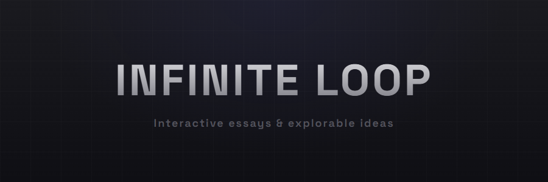

<p align="center">
  
</p>

<p align="center">
  <em>Blog posts that are single-page apps. Because static text is so 2010.</em>
</p>

<p align="center">
  <a href="#the-problem">The Problem</a> •
  <a href="#the-solution">The Solution</a> •
  <a href="#the-stack-post">The Stack</a> •
  <a href="#architecture">Architecture</a>
</p>

---

## The Problem

You write a blog post. It's good. People skim it, maybe bookmark it, probably forget it.

The format hasn't evolved since the printing press. Title, paragraphs, maybe a code block. Scroll down, reach the end, close the tab. The content is static because blogs are static because that's how blogs work because that's how they've always worked.

But you're not writing for paper anymore. You're writing for browsers. Browsers that can run JavaScript. Browsers that can filter, search, animate, respond.

**Why are we still publishing PDFs with extra steps?**

---

## The Solution

Infinite Loop treats each blog post as a **full interactive application**.

Not "interactive" like "has a comment section." Interactive like:

- **Filterable** — 97 tools? Filter by category, status, or search in real-time
- **Explorable** — Expand cards, reveal details, dive deeper without page loads
- **Animated** — Staggered transitions, hover states, visual feedback
- **Stateful** — Your filters persist, your context stays, your scroll position matters

Each post is a React component with its own state management, its own data system, its own UI logic. The "blog" part is just routing.

It's what happens when you stop asking "how do I write about this?" and start asking "how do I let people *experience* this?"

---

## The Stack (Post)

The inaugural entry: **[The Stack](https://andreratzenberger.github.io/infinite-loop/the-stack)** — an opinionated guide to 97 developer tools for 2025-2026.

Not a listicle. An explorable interface.

| What You Get | How It Works |
|--------------|--------------|
| 97 tools across 15 categories | Markdown files with YAML frontmatter |
| Real-time search | Filter as you type, results update instantly |
| Category & status filters | Click to narrow, click again to clear |
| Expandable "Why this?" sections | One click reveals the rationale |
| External links | Every tool links to its source |

The content lives in markdown. The UI is pure React. Add a new `.md` file, get a new card. No code changes required.

**The voice**: Pratchett-esque playful prose. Technical accuracy with personality.

> *"Pandas walked so Polars could sprint. Lazy evaluation means it won't try to load your entire dataset into memory like an overenthusiastic golden retriever."*

---

## Architecture

```
src/
├── posts/
│   ├── registry.js              # Post metadata & routing
│   └── 2025-12-01-the-stack/
│       ├── index.jsx            # Interactive UI (~600 lines)
│       └── data/
│           ├── index.js         # Markdown loader
│           └── [15 categories]/ # Tool markdown files
├── pages/
│   └── Home.jsx                 # Landing page
└── components/
    └── PostLayout.jsx           # Post wrapper
```

**Adding a new post:**

1. Create `src/posts/YYYY-MM-DD-slug/index.jsx`
2. Export a React component (go wild)
3. Register in `registry.js`
4. Route auto-generated. Done.

Each post gets full creative freedom. No template enforced. Want WebGL? Do it. Want a game? Do it. Want a traditional article? Sure, but why?

---

## The Philosophy

**Merit over market share.** The Stack doesn't recommend tools because they're popular. It recommends tools because they're good. Sometimes those overlap. Often they don't.

**Best-in-class over biggest-in-market.** The defaults aren't always the answer. The essay exists to surface the alternatives worth knowing.

**Experience over consumption.** Reading is passive. Exploring is active. When you can filter, search, and expand, you're not consuming content. You're navigating it. That's a different relationship with information.

---

## Tech

- **React 18** — UI framework
- **Vite 5** — Dev server & bundling
- **React Router v6** — Client-side routing
- **Markdown + Frontmatter** — Content storage
- **CSS-in-JS** — Inline styles for full post control

No CMS. No build-time static generation. No external dependencies for content. Just React components that happen to render essays.

---

## What's Next

More posts. Different formats. Same principle: **ideas rendered as experiences**.

The blog is the app. The app is the blog. The loop is infinite.

---

<p align="center">
  <em>Built with React, Vite, and the conviction that content deserves better than static HTML.</em>
</p>

## License

MIT — Go forth and make blogs interesting again.
