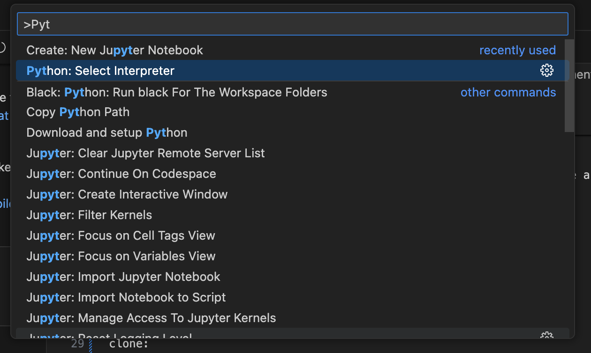
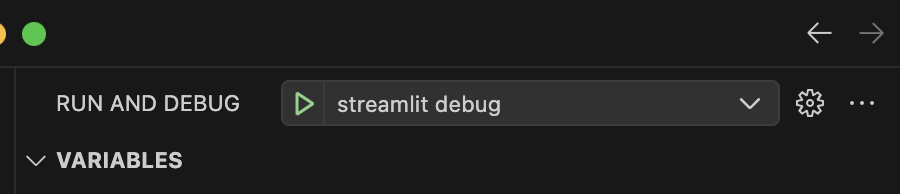

# infinite-loop

Content repository for the 'infinite-loop' blog

## How to get started

### Install poetry

```bash
pip install poetry
```

### Install python 3.10.x

Use your favourite way to install python 3.10.x

My recommendtaion:

Get [miniconda](https://docs.anaconda.com/free/miniconda/) and create a python 3.10 environment

To replicate my environment then run

```bash
conda create -n 'your-env-name' python=3.10.12 
```

### Clone this repository and open it in VSCode

clone:
```
git clone https://github.com/AndreRatzenberger/infinite-loop
```

### Switch environment

either via VSCode Command palette



or

```bash
conda activate 'your-env-name' 
```

### Install packages with poetry

In the project root run

```bash
poetry install
```

### Open the app.py in the edior and start the "streamlit debug" task in the debugger


